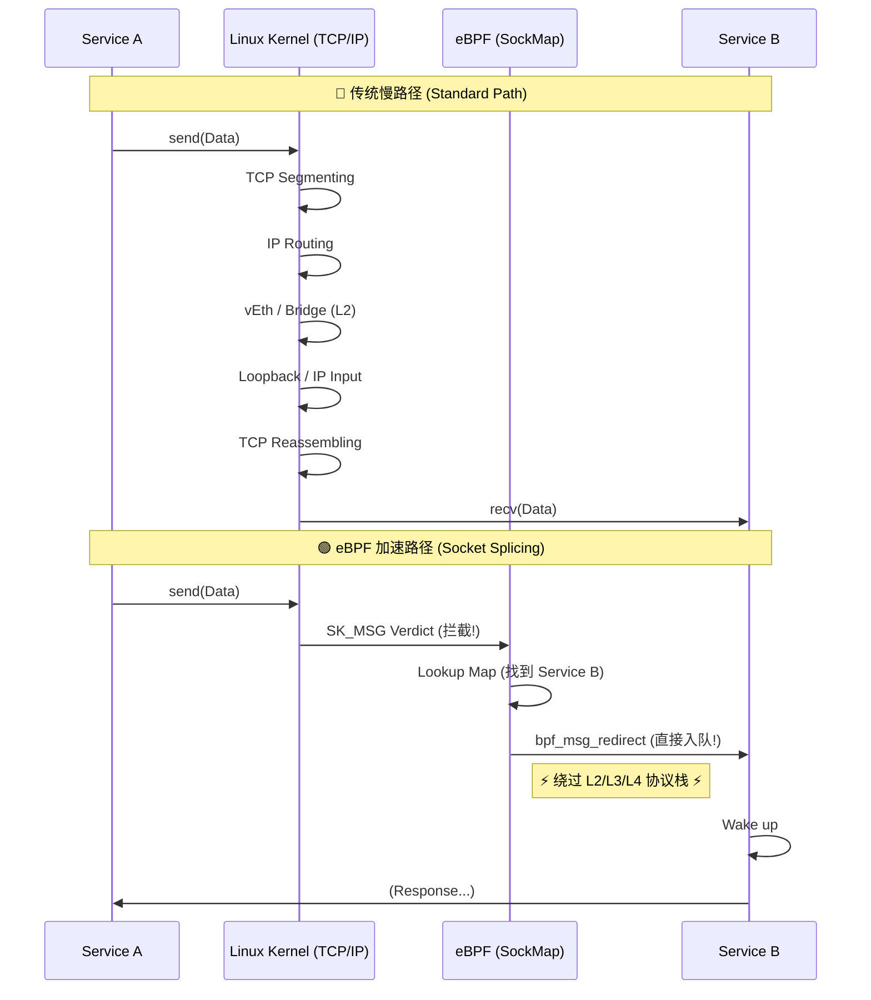

# eBPF Socket Splicing 加速原理

本工程的 **Phase 8 (High Performance Gateway)** 采用了基于 `SockMap` 的 Socket Splicing 技术。这是一种高性能的内核旁路方案，常用于 Sidecar 加速（如 Istio Ambient Mesh）。

## 1. 核心思想

**Short-Circuiting the TCP/IP Stack (短路协议栈)**

在传统的容器间（或同一节点微服务间）通信中，数据包需要经过极其漫长的路径：
1. App A 发送数据 (`send()`)。
2. 进入内核，走完整的 TCP 协议栈 (L4)。
3. 走 IP 路由和 iptables/Netfilter (L3)。
4. 通过 vEth 设备对，经过 Docker Bridge (L2)。
5. ...（在接收端重复上述步骤）...
6. App B 接收数据。

**使用 eBPF Splicing 后**：
1. App A 发送数据 (`send()`)。
2. **eBPF 拦截**: 发现在本地有对应的 App B Socket。
3. **Redirection**: eBPF 直接将数据从 App A 的 Send Queue 拷贝到 App B 的 Receive Queue。
4. App B 唤醒，读取数据。

**结果**: 整个网络协议栈（L2/L3/L4）被完全绕过，通信延迟从毫秒级降低到微秒级。

## 2. 架构组件

我们使用了两个关键的 eBPF Program：

### (1) SOCK_OPS (`handle_sock_ops`)
- **角色**: 注册员
- **触发时机**: TCP 连接建立完成时 (`ESTABLISHED`)。
- **动作**:
    1. 捕获连接的四元组 (SrcIP, DstIP, SrcPort, DstPort)。
    2. 将 Socket 的内核句柄 (Struct sock*) 存入 `INTERCEPT_MAP` (类型为 `BPF_MAP_TYPE_SOCKHASH`)。

### (2) SK_MSG (`redirect_traffic`)
- **角色**: 路由器
- **触发时机**: 应用发起 `sendmsg` 系统调用时。
- **动作**:
    1. 计算反向查询 Key (即 "谁是我的对端？")。
    2. 在 `INTERCEPT_MAP` 查找对端 Socket。
    3. 如果找到，调用 `bpf_msg_redirect_hash`。
    4. **Magic Happens**: 数据直接出现在对端的接收队列中。

## 3. Map Key 设计

为了准确匹配通信对端，我们需要处理**字节序 (Endianness)**。

- **eBPF (网络层)**: 使用 Big Endian (网络字节序)。
- **Socket Key**: 我们约定统一转换为 **Host Endian** (主机字节序)。

**Key 定义**:
```rust
struct SockKey {
    sip: u32,
    dip: u32,
    sport: u32, // Host Endian
    dport: u32, // Host Endian
}
```
当 A 发给 B 时，eBPF 会构造一个 Key `{sip: B_IP, dip: A_IP, sport: B_Port, dport: A_Port}` 来查找 B 的 Socket。

## 4. 性能提升预期

根据业界基准测试（如 Cilium/Istio 数据）：
- **吞吐量**: 提升 10% - 30%。
- **延迟**: 降低 40% - 60%。
## 5. 深入解析: 为什么看起来这么简单？

您可能会疑惑：*“代码也就几百行，怎么就能绕过整个协议栈了？”*

这正是 **eBPF (Programmable Kernel)** 的魅力所在。复杂的脏活累活（如内存管理、锁、队列操作）都由 Linux 内核封装好的 **Helper Functions** 承担了。

我们调用的关键函数 `bpf_msg_redirect_hash` 实际上触发了内核深处的一系列复杂操作：
1.  **Look up**: 在 Map 中找到目标 `struct sock` 对象。
2.  **Lock**: 自动获取目标 Socket 的锁。
3.  **Enqueue**: 将当前发送的数据包（`sk_msg`，本质是分散聚合链表）直接挂到目标 Socket 的 **Receive Queue** 上。
4.  **Wake up**: 唤醒目标进程的 `recv()` 等待。

### 流量路径对比 (Mermaid)



**总结**: 
- **用户态** 只是负责“牵线搭桥”（建立 Map）。
- **内核态 eBPF** 负责“智能调度”（查表 Redirect）。
- **Linux 内核** 负责真正“瞬移数据”（Helper Function 实现细节）。
