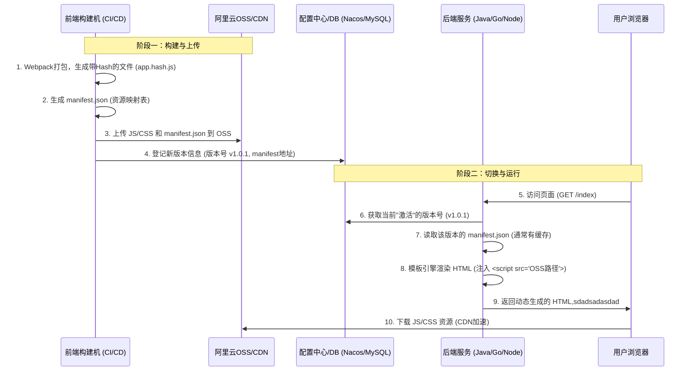

# Research: Core Observability Baseline

**Feature**: Core Observability (Process & Network)
**Status**: Complete
**Date**: 2025-12-09

## Decisions

### 1. Process Monitoring Method
- **Decision**: Use `tracepoint:sched/sched_process_exec`.
- **Rationale**: Standard, stable kernel API for capturing new process executions. Less brittle than kprobes on internal functions.
- **Alternatives**:
  - `kprobe/sys_execve`: Flaky due to syscall variants (`execveat`, etc.).
  - `netlink`: Good but asynchronous and higher overhead for high-volume process churn.

### 2. Connection Tracking Method (IPv4)
- **Decision**: Use `kprobe/tcp_v4_connect` (outbound) and `kretprobe/inet_csk_accept` (inbound).
- **Rationale**:
  - `tcp_v4_connect` allows capturing the destination IP/port at initiation.
  - `inet_csk_accept` returns the socket after a successful handshake, providing access to remote peer info.
- **Alternatives**:
  - `tracepoint:sock/inet_sock_set_state`: Good for state changes but requires more complex state machine matching to filter only new connections.

### 3. Traffic Volume (Approximation)
- **Rationale**: Direct hook into the data transmission path to count bytes.
- **Complexity**: Requires `kprobe` to read arguments/structures.

### 4. Kubernetes Context (Pod Awareness)
- **Decision**: Userspace correlation via **Cgroup ID**.
- **Rationale**:
  - eBPF captures `bpf_get_current_cgroup_id()`.
  - Userspace Agent queries Kubelet API (or watches Pods) to map Cgroup ID -> Pod Name/Namespace.
  - **Lightweight approach**: Read `/proc/<pid>/cgroup` to find pod UID if API access is heavy.

### 5. L7 Observability (HTTP & Latency)
- **Decision**: Userspace Protocol Analysis.
- **Rationale**:
  - eBPF emits `TcpEvent` with payload prefix (first N bytes).
  - Userspace buffers and parses "GET /..." to extract URL.
  - Latency = Time(Response) - Time(Request) matched by tuple {src, dst, port}.
  - Keeps kernel logic simple (Constitution: "Safe Complexity").

### 6. Implementation Framework
- **Decision**: `aya-rs` (as per Constitution).
- **Rationale**: Pure Rust, no LLVM runtime dependency on target, supports CO-RE (Compile Once – Run Everywhere) for portability across kernel versions (5.x+).

## Constitution Alignment
- **Observability First**: All probes will emit structured events.
- **Lightweight**: Pure Rust binary, no BPF CO-RE heavy dependencies unless needed.
- **Verification**: Can be tested via simple shell commands (`curl`, `ls`).

